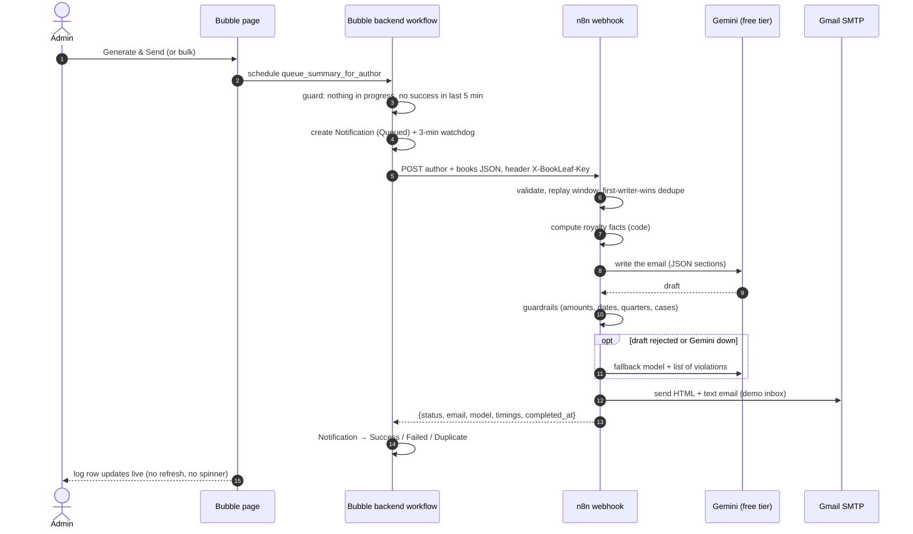

# BookLeaf · Author Royalty Dashboard & Automated Notification System

Authors sign in to see their books and royalties. The BookLeaf ops team sees every author and can send AI-written royalty summary emails, one author at a time or in bulk. **Bubble.io** is the app (database, privacy rules, UI, workflows). **n8n** is the automation backend (webhook → royalty facts → Gemini → guardrails → email → status back to Bubble).

| | |
|---|---|
| **Live app** | `https://bookleaf-royalty.bubbleapps.io/version-test` *(free plan = development version)* |
| **Bubble editor (read-only)** | *link added at submission* (Application rights → Everyone can view) |
| **n8n workflows** | [`n8n/workflows/royalty-summary.workflow.json`](n8n/workflows/royalty-summary.workflow.json), [`n8n/workflows/error-handler.workflow.json`](n8n/workflows/error-handler.workflow.json) |
| **Sample AI emails** | [`docs/sample-emails/`](docs/sample-emails/): all 10 authors, two as-of dates |
| **Stack cost** | ₹0: Bubble Free, n8n Cloud trial (built and tested on self-hosted n8n), Gemini free tier, Gmail SMTP |

### Demo accounts (password `BookLeaf@2026`)

| Login | Why it's interesting |
|---|---|
| `admin@bookleaf.demo` | Admin: all authors, filters, Generate & Send, bulk send, notification log |
| `ananya.reddy@email.com` | One book, ₹2,546 pending and **never paid** → red |
| `kavita.deshmukh@email.com` | ₹850 pending (**below the ₹1,000 minimum** → yellow, rolls over) + a book in **Typesetting** |
| `sneha.kulkarni@email.com` | Three books, one in **Cover Design** |
| `farhan.sheikh@email.com` | Everything **paid up** → green |
| any other author from the dataset | e.g. `priya.sharma@email.com`, `rohit.kapoor@email.com` |

---

## Contents
1. [What was built](#1-what-was-built)
2. [Architecture](#2-architecture)
3. [Bubble database schema and why](#3-bubble-database-schema-and-why)
4. [How Bubble and n8n talk to each other](#4-how-bubble-and-n8n-talk-to-each-other)
5. [The n8n workflow](#5-the-n8n-workflow)
6. [AI prompt strategy](#6-ai-prompt-strategy)
7. [Error handling and idempotency](#7-error-handling-and-idempotency)
8. [Testing](#8-testing)
9. [Running it yourself](#9-running-it-yourself)
10. [Challenges and learning process](#10-challenges-and-learning-process)
11. [Limitations and next steps](#11-limitations-and-next-steps)

---

## 1. What was built

**Author portal (Bubble)**
- Email/password sign-in; each author sees only their own data (enforced by privacy rules, §3).
- *My Books*: title, ISBN, genre, status, publication date, MRP, platforms. Books in production show their stage ("Cover Design, stage 3 of 9").
- *Royalty overview*: per book copies sold, earned, paid, pending and last payout date, plus totals (earned / paid / pending) across all books.
- *Status badge* per book and per author: 🟢 Paid up · 🟡 Pending (within the cycle, or below the ₹1,000 minimum) · 🔴 Overdue (≥ ₹1,000 pending and last payout > 90 days ago, or never paid and published > 90 days ago) · ⚪ In production.

**Admin portal (Bubble)**
- Author overview with totals, filterable by **city** and **payout status**, searchable by **name**.
- Author detail page: the same view the author gets, plus **payout history** and that author's notifications.
- **Generate & Send Royalty Summary** per author, and **bulk send** to every author with pending royalties (the same webhook, once per author, 8 s apart).
- **Notification log**: who was sent what and when, Success / Failed / Duplicate with the reason, timing, AI model, and a preview of the exact email. It updates live as n8n finishes.
- **Status as-of date**: *today* (default) or the *dataset snapshot (1 Jan 2026)*. Every payout in the dataset is from Dec 2025 or earlier, so on today's date almost every pending balance is overdue. The snapshot shows the full green/yellow/red spread. The date in use is always displayed, and the emails use the same date.

**Automation (n8n + Gemini)**: a 38-node workflow plus an error-handler workflow; details in §5–§7.

## 2. Architecture



## 3. Bubble database schema and why

```
User ──1:1── Author ──1:n── Book ──1:1── Royalty Record
                │             │
                │             └──1:n── Payout
                └──1:n── Royalty Notification (log)        App Settings (1 row)
```

| Type | Holds | Key fields |
|---|---|---|
| **User** | login only | `role` (option set Author/Admin), `author` |
| **Author** | profile + stored rollups | `author_code`, name, email, phone, city, joined_date, `account`, `payout_status`, `total_books/copies/earned/paid/pending`, `overdue_books` |
| **Book** | catalogue & production | `book_code`, `author`, `owner`, title, ISBN, genre, `status` (option set with `stage_no`, `is_published`), publication_date, MRP, `print_partner`, `available_on` (list of Platform), `royalty` |
| **Royalty Record** | the money for one book | `book`, `author`, `owner`, royalty_per_copy, copies_sold, earned, paid, pending, last_payout_date, `payout_status`, `status_reason` |
| **Payout** | payout history | `book`, `author`, `owner`, amount, paid_on, note |
| **Royalty Notification** | the notification log | `author`, `triggered_by`, `trigger_type`, `batch_id`, `status`, requested/started/completed timestamps, email subject/HTML/text, intended vs delivered recipient, AI model & attempts, prompt version, n8n execution id, error code/message, duration |
| **App Settings** | configuration | status as-of date and mode, cooldown, bulk interval, sign-up switch |

Option sets: `Role`, `Book Status`, `Platform`, `Print Partner`, `Payout Status` and `Notification Status` (both with badge colours as attributes), `Trigger Type`.

**Why it's shaped this way**
- **Authors, books and money are separate types** because they change for different reasons. A book's catalogue data isn't its royalty ledger, and *Royalty Record* can grow into one row per quarter later without touching *Book*.
- **Option sets for fixed vocabularies** (statuses, platforms, partners). They can't be mistyped, cost no database reads, and carry attributes like `is_published` and the badge colours that the UI and the workflows use.
- **`owner` (User) is copied onto every author-owned row.** Each privacy rule is then one direct check, *This Book's owner is Current User*, instead of a multi-hop lookup. That makes the rules fast, easy to audit, and hard to get wrong.
- **The dataset's IDs are kept** (`author_code`, `book_code`). The CSV import links on them, and every row can be traced back to `bookleaf_sample_data.json`.
- **Rollups and statuses are stored, not computed in the page**, so the admin list filters with plain server-side search constraints. A backend workflow refreshes them (on import, when the as-of date changes, and on the first admin visit each day, because free plans have no scheduled jobs).
- **Payout history:** the dataset records only the amount paid to date and the latest payout date, not individual payouts, so each book gets one honestly labelled *Payout* row. Real payouts would simply append rows.

**Privacy rules** (Data → Privacy): authors can find and read only their own User, Author, Book, Royalty Record and Payout rows; admins can read everything; the notification log is admin-only; everyone else gets nothing. The rules run on Bubble's server, so another author's rows never reach the browser. The automated tests in §8 sign in as different authors to prove it.

The click-by-click build (every field, rule, workflow and expression) is in **[docs/bubble-build-guide.md](docs/bubble-build-guide.md)**.

## 4. How Bubble and n8n talk to each other

**Trigger.** Both buttons call one Bubble backend workflow, `queue_summary_for_author`. It refuses to run if the author already has a summary queued or processing, or one sent in the last 5 minutes. Otherwise it creates the Notification (Queued), schedules `send_royalty_summary`, and schedules a 3-minute watchdog. Bulk send runs the same workflow over *authors with pending royalties*, 8 seconds apart (Gemini free-tier rate limit).

**Call.** `send_royalty_summary` marks the row *Processing* and calls n8n through the **API Connector**, server-side. The `X-BookLeaf-Key` header is marked *Private*, so it never reaches a browser.

**Fetching data: the full payload travels in the webhook.** The brief allows either approach. I chose the payload because:
1. Bubble's **free plan doesn't serve its Data API to outside callers** (it returns 401), so n8n *can't* query Bubble.
2. Even on a paid plan it would mean storing a Bubble admin token in n8n. With the payload, n8n holds no Bubble credentials at all.
3. One network hop fewer means one failure mode fewer, and the email describes exactly the figures the admin was looking at.
4. The payload is assembled in a backend workflow from the database, not from the browser, so it can't be tampered with client-side. n8n still re-validates it and rejects figures that don't add up (earned ≠ paid + pending).

**Status update: n8n answers in its webhook response.** The brief's step 5 describes n8n calling Bubble back, but the free plan blocks inbound Workflow API calls too. So n8n finishes the job (≈3 s typically, under a minute worst case) and returns the outcome in the HTTP response. Bubble's backend workflow then writes Success / Failed / Duplicate, the email, the AI model and n8n's `completed_at` timestamp into the log. The admin's page never waits on this: it's a scheduled backend workflow, and Bubble pushes the row's changes to the open page. On a paid plan the same contract becomes a true asynchronous callback (n8n returns 202, then POSTs the same JSON to a Bubble backend endpoint authenticated with a bearer token). Nothing else changes.

**Security**
- **Header auth on the n8n webhook:** a missing or wrong key gets 403 before the workflow even starts.
- **Replay protection:** n8n rejects requests whose `requested_at_ms` is more than 10 minutes old, and a replayed `notification_id` is answered as a Duplicate.
- **Server-side only:** Bubble's key header is Private, and the call runs in a backend workflow.
- **Privacy rules** on every author-owned type.
- **No public sign-up:** logins were created through a setup page that is now switched off.

## 5. The n8n workflow

The main workflow is **BookLeaf · Royalty Summary**: 38 nodes in five labelled sections (sticky notes in the canvas).

| Section | Nodes | What happens |
|---|---|---|
| 1 · Receive & validate | Webhook (header auth) → Config → Validate request → *Request valid?* → Tag execution → *Dry run?* | Reject bad/stale input with 400 and reasons; tag the execution with notification and author IDs (searchable in n8n); dry runs answer instantly (used to initialise Bubble's API Connector) |
| 2 · Idempotency | Ensure runs table → Record run start → Find recent runs → Check for duplicate → *Is duplicate?* | **First writer wins** on an n8n Data Table (§7) |
| 3 · Facts → Gemini → guardrails | Compute royalty facts → Build request → Gemini (primary) → Check output → *OK?* → fallback request → Gemini (fallback) → Check → *OK?* | Two models from different families, both with retries; error outputs and IF branches route every failure |
| 4 · Deliver & answer | Render email → *Email enabled?* → Send email → *Overdue?* → Alert finance team → Record run success → Build response → **Respond · result** | HTML + text email; the finance alert makes the email's "we'll update you in 48 hours" promise real |
| 5 · Failure path | Classify failure → Record run failure → Build failure response → Respond | Names the cause with both attempts' errors; keeps the generated email when only delivery failed |

**Error handler workflow:** Error Trigger → mark the run *crashed* in the Data Table → email ops with a link to the failed execution. This is set as the main workflow's *Error workflow*, so even an unexpected crash isn't silent. (Bubble receives an HTTP 500 in that case and marks the row Failed.)

**Code nodes are generated from tested source.** The logic lives in [`n8n/src/`](n8n/src) as plain JavaScript (38 unit tests). [`scripts/build-workflows.mjs`](scripts/build-workflows.mjs) inlines into each Code node only the functions it needs. The workflow JSON is therefore reproducible, and what the tests cover is exactly what runs in n8n.

## 6. AI prompt strategy

**1. The model writes words; code writes numbers.** *Compute royalty facts* works out everything factual before the model sees anything:
- totals, and each book's state (paid up / pending / below ₹1,000 / overdue / never paid / in production)
- the payout calendar, from the Knowledge Base: quarterly calculation, paid within 45 days of quarter end, so on 7 Oct 2026 the next payout is "Q3 2026, by 14 Nov 2026"
- the list of "cases" the email must cover

The model receives these as pre-formatted strings (`₹11,970`, `14 Nov 2026`) and is told to copy, never compute. The figures table and the three totals in the email are rendered from these facts by code. So is the **subject line**, after testing showed the model once appended an unrelated phrase to it.

**2. Structured output.** Gemini returns JSON with one field per email section, enforced by `responseJsonSchema`: preheader, greeting, opening, one note per book, totals, payout explanation, production update, closing. This guarantees the brief's checklist structurally: personalised greeting, per-book summary, totals breakdown, payout timing, paid-up acknowledgement, production status, warm closing.

**3. Knowledge Base and tone in the system prompt.** It carries the royalty policy (80/20, quarterly + 45 days, ₹1,000 minimum, bank transfer, dashboard breakdown, 48-hour escalation for overdue payouts), the production stages, and Assignment 1's tone rules:
- authors are partners
- be specific
- own delays plainly without blaming anyone
- "we", not "I"
- Indian English

It also has an explicit rule per case. Static instructions go first and per-author facts last, which keeps prompt caching effective. The prompt is versioned (`royalty-summary-v2`) and every log row records the version.

**4. Guardrails, then a second opinion.** Every draft is checked before it can be sent. The checks reject:
- any ₹ amount, date or quarter that isn't in the facts
- a real amount used in the wrong place (a book's figure quoted as a total)
- a missing or invented book
- an overdue balance without the 48-hour finance update
- a sub-₹1,000 balance without the minimum-payout explanation
- pending money without the next payout date and the 45-day rule
- placeholders, escaped characters, or addressing the reader as "the author"

A rejected draft goes to a **different model family** together with the list of violations to fix.

**Edge cases from the dataset**
- *Ananya*: never paid, overdue → apology + finance escalation + next payout date.
- *Kavita*: ₹850 is below the minimum → rolls over, explicitly not in the next payout; her Typesetting book gets a production update.
- *Sneha*: a Cover Design book → a nudge that prompt cover approval keeps things moving.
- *Farhan*: all paid → positive acknowledgement.

**Results** (real runs, all 10 authors × 2 as-of dates; emails in [`docs/sample-emails/`](docs/sample-emails/)):

| | |
|---|---|
| Emails delivered | **20 / 20** |
| Accepted on the first draft | 18 / 20 (90%); the other 2 were fixed by the fallback |
| Typical time | ≈ 3 s end to end (worst case seen 12.7 s, with fallback) |
| Models | `gemini-3.5-flash-lite` (primary) → `gemini-3.1-flash-lite` (fallback), ~500 free requests/day **each** |

**What the evaluation caught.** Reading every email changed the design four times:
1. Gemini returned `₹` instead of `₹`, which hid amounts from the checks → escapes are now decoded before checking.
2. One subject line gained a stray phrase → the subject is now built by code.
3. *"pending from sales up to Q2 2026"* was an invented claim → the model now sees only the next payout's quarter, and the guardrail allows only that one.
4. A book's ₹2,540 was quoted as the author's total pending of ₹4,115 → section-aware amount checks.

## 7. Error handling and idempotency

| Failure | Where it's caught | What the admin sees in Bubble |
|---|---|---|
| n8n unreachable / timeout | API Connector *include errors* → step 6 | **Failed** · `n8n HTTP …` + connection error |
| Wrong/missing webhook key | n8n header auth | **Failed** · `n8n HTTP 403` |
| Invalid or inconsistent payload | *Validate request* | **Failed** · `n8n HTTP 400` + which field |
| Gemini error / quota / overload | retries → fallback model → *Classify failure* | **Failed** · `ai_unavailable` + both errors |
| Drafts fail the checks twice | guardrails ×2 → *Classify failure* | **Failed** · `ai_output_invalid` + violations |
| SMTP rejects the email | email node error output | **Failed** · `email_failed` (email kept for resend) |
| Unexpected crash in n8n | Error workflow (ops email + run marked crashed) | **Failed** · `n8n HTTP 500` |
| Bubble's own workflow dies | `mark_timed_out` watchdog (3 min) | **Failed** · `timeout` |
| Data-table bookkeeping fails | those nodes continue on error | nothing: bookkeeping never blocks the answer |

**Idempotency, three layers**
1. **UI:** the button disables immediately and stays disabled while a summary is queued/processing and for 5 minutes after a success.
2. **Bubble backend:** `queue_summary_for_author` re-checks the same condition server-side, which also covers two admins or two tabs.
3. **n8n, first writer wins:**
   - every run *inserts* its own row in the `royalty_summary_runs` Data Table first
   - it then reads all runs for that author in the window
   - the lowest row id still processing or already succeeded owns the author, and every other run answers **Duplicate**
   - two simultaneous requests see the same rows, so they agree on the winner without needing an atomic lock (n8n Data Tables don't offer one)
   - a replayed `notification_id` is always a Duplicate
   - failed runs never block a retry

The smoke test fires two requests at the same instant: exactly one email goes out.

## 8. Testing

| Suite | Command | What it proves |
|---|---|---|
| Unit (38 tests) | `npm test` | Every author's status on two dates; 90-day boundary; quarterly calendar; validation & replay window; first-writer-wins dedupe; guardrails catching each failure seen in testing; email escaping; the Code-node composer |
| Webhook smoke (13 checks) | `npm run smoke` | Against a running n8n: 403 without/with wrong key, 400 for malformed/stale/inconsistent data, happy path + email delivered, replay → Duplicate, **simultaneous double click → one email**, AI failure → Failed with both reasons, email failure → Failed with the email kept |
| Error workflow | (manual, documented) | A deliberately crashing build: Bubble gets HTTP 500 and ops receive "crashed at *Compute royalty facts*" |
| Sample emails | `npm run emails [-- --as-of 2026-01-01]` | All 10 authors through the live workflow, saved for review |
| Bubble end-to-end | `npm run test:e2e` | Signs in as three different authors and checks each sees only their own books; authors are bounced from admin pages; admin filters by city/status/name; optional real Generate & Send |

## 9. Running it yourself

**Import into n8n (Cloud or self-hosted)**
1. *Workflows → Import from file*: first `error-handler.workflow.json`, then `royalty-summary.workflow.json`.
2. Create three credentials and select them on the nodes that show a warning:
   - **Header Auth**: name `X-BookLeaf-Key`, value = a long random secret. Use the same value in Bubble's API Connector.
   - **Google Gemini(PaLM) API**: your Gemini API key (free tier from aistudio.google.com).
   - **SMTP**: e.g. Gmail: host `smtp.gmail.com`, port 465, SSL on, user = your Gmail, password = a Google *App password*.
3. Open the **Config** node: set `demo_recipient`, `from_email` and `finance_alert_recipient`. `demo_mode` sends every email to the demo inbox, because the dataset's `@email.com` addresses are real-looking mailboxes.
4. Main workflow → *Settings* → *Error workflow* → **BookLeaf · Error handler**. **Publish** both workflows.
5. The production URL is `https://<your-n8n>/webhook/bookleaf/royalty-summary`. The run log table is created automatically on the first call.

**Build the Bubble app:** follow [docs/bubble-build-guide.md](docs/bubble-build-guide.md). The CSVs for the import are in [`data/bubble-import/`](data/bubble-import).

**Local development** (Docker): run n8n and Mailpit, then `bash scripts/local-n8n-deploy.sh` builds the workflows with local settings and imports, publishes and restarts them. Copy `.env.example` to `.env` for the test scripts.

```bash
npm install
npm test                                   # unit tests
npm run build:workflows                    # regenerate n8n/workflows/*.json from n8n/src + n8n/config.json
npm run build:csv                          # regenerate the Bubble CSVs from the dataset
npm run smoke                              # end-to-end against N8N_WEBHOOK_URL
npm run emails -- --as-of 2026-01-01       # sample emails for all authors
node scripts/bubble-create-logins.mjs      # create the demo logins in Bubble
npm run test:e2e                           # Bubble end-to-end tests
```

## 10. Challenges and learning process

The full dated log is in **[docs/learning-log.md](docs/learning-log.md)**. The highlights:

- **The free plans shaped the architecture, so I verified them before building:**
  - Bubble Free has no inbound Data/Workflow API, which led to the full-payload webhook and the response-as-callback design.
  - It has no collaborators, so reviewers get a read-only editor link.
  - It has no recurring workflows, so statuses refresh on the first admin visit each day.
  - It has no live deploy, so the app runs at `version-test`.
- **Gemini's free tier changed under me.** `gemini-2.5-flash` stopped after **20 requests in a day**. I only noticed because the fallback kept the emails flowing while the primary returned 429s. The Flash-Lite models allow ~500 a day each, so the primary/fallback pair now gives ~1,000 free emails a day.
- **The AI output needed the most iteration.** All four fixes in §6 came from reading every generated email, not from the first prompt.
- **n8n 2.x** introduced *publishing* workflow versions. After a CLI import and restart, the webhook answers 404 for a few seconds before re-registering, so the deploy script waits until it answers 403 ("registered, wrong key").
- **Bubble** was new to me. *[Your own notes go here: what clicked, what didn't, which manual pages and videos helped. See the prompts in the learning log.]*

## 11. Limitations and next steps

- **Async callback on a paid plan.** n8n would answer 202 at once and POST the same JSON to a Bubble backend endpoint. That removes the response time limit and lets n8n retry the callback.
- **Real payout ledger.** One row per actual payout and per quarter, which also makes "overdue" exact rather than inferred from the last payout date.
- **Daily status refresh** as a recurring Bubble workflow (paid), instead of on the first admin visit.
- **Real recipients:** switch `demo_mode` off once real author addresses and a verified sending domain exist.
- **Resend button** for `email_failed` rows, reusing the stored email instead of regenerating it.
